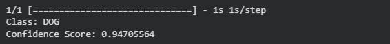

# 🐱🐶 Cats vs Dogs Image Classifier

A simple image classification project that identifies whether an input image contains a **Cat** or a **Dog** using a model trained with **Google Teachable Machine** and **TensorFlow Keras**.

---

## 📌 Project Overview

This project demonstrates how to build an image classification model using Google Teachable Machine and use it in Python through Google Colab. The model predicts whether the uploaded image belongs to the **Cat** or **Dog** class and displays the prediction confidence.

---

## 🛠 Technologies Used

- Google Teachable Machine
- Google Colab
- Python
- TensorFlow Keras
- NumPy
- Pillow

---

## 📂 Repository Contents

```text
Cats-vs-Dogs-Image-Classifier
│
├── Cats_vs_Dogs_Classifier.ipynb
├── keras_Model.h5
├── labels.txt
├── Test_Image.png
├── Python_Output.png
└── README.md
```

---

## ⚙️ Workflow

1. Create and train the image classification model using Google Teachable Machine.
2. Export the trained model in TensorFlow Keras format.
3. Upload the model files to Google Colab.
4. Load the model using Python.
5. Upload a test image.
6. Predict whether the image is a Cat or a Dog.
7. Display the predicted class and confidence score.

---

## 📄 Model Files

- **keras_Model.h5** – Trained image classification model.
- **labels.txt** – Class labels used by the model.
- **Cats_vs_Dogs_Classifier.ipynb** – Google Colab notebook containing the prediction code.
- **Test_Image.png** – Sample image used for testing.
- **Python_Output.png** – Screenshot showing the prediction result.

---

## 🖼 Test Image

<p align="center">
  
</p>

---

## 🖥 Output Preview

<p align="center">
  
</p>

---

## ▶️ How to Run

1. Open **Cats_vs_Dogs_Classifier.ipynb** in Google Colab.
2. Upload the following files:
   - `keras_Model.h5`
   - `labels.txt`
   - `Test_Image.png`
3. Run all cells.
4. The model will predict the image class and display the confidence score.

---

## ✅ Example Result

```
Class: DOG
Confidence Score: 0.94705564
```

---

## 👩🏻‍💻 Author

**Sama Alzahrani**

Computer Engineering Student
